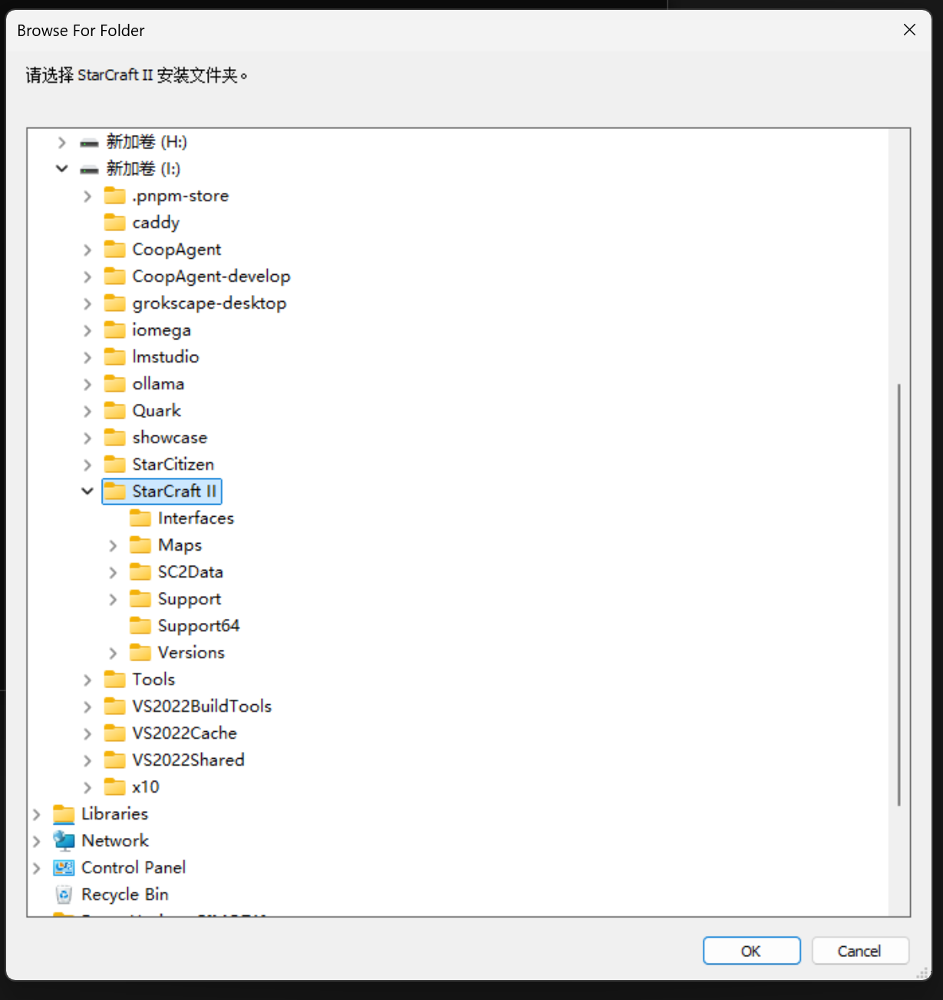
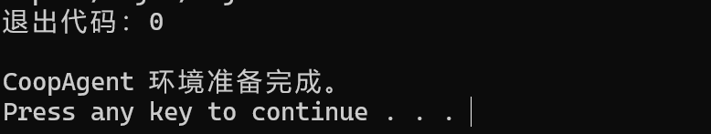
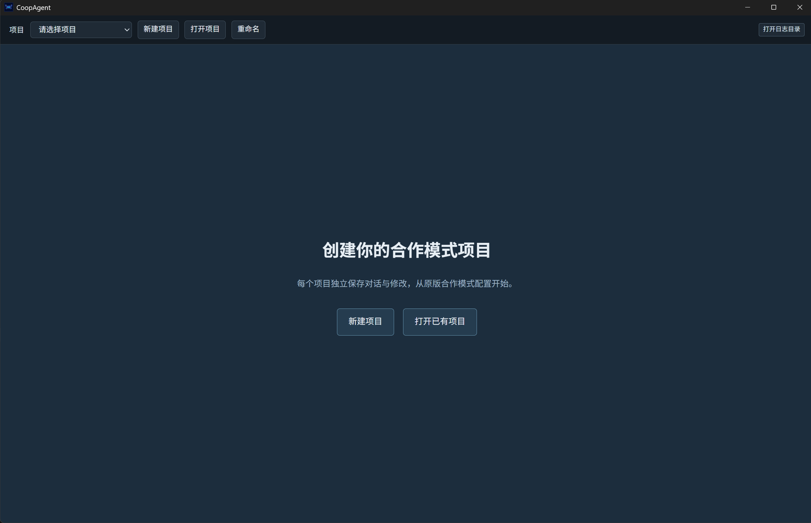

# 安装指南

本指南适用于 Windows x64 源码版本。从仓库根目录运行以下命令；首次准备和编译可能需要一段时间。

安装完成后，按照[使用指南](user-guide.md)创建项目、配置模型并进行第一次修改。

## 使用前准备

- 已安装《星际争霸 II》。
- Python 3.10 或更新的 **64 位**版本，命令行须能运行 `python`（[官方下载](https://www.python.org/downloads/windows/) · [官方 Windows 安装说明](https://docs.python.org/3/using/windows.html)）；命令行可用的 Git for Windows。
- Visual Studio 2022 或 2026 的 C++ 构建工具（MSVC、MSBuild、CMake 和 Windows SDK）；缺少时可参考该教程：[安装 C++ 构建工具](install-cpp-build-tools.md)。
- 一个可用的模型 API 配置。
- 建议预留至少 20 GiB 磁盘空间，用于工具链、游戏数据库和构建缓存。

`setup.cmd` 会在下载前检查所需系统组件；缺少时会显示安装说明。

## 安装并启动

1. 使用 Git 克隆 CoopAgent 仓库：`git clone https://github.com/ZHHHCY/CoopAgent.git`，然后进入 `CoopAgent` 文件夹。
2. 双击 `setup.cmd`。
3. 在文件夹选择窗口中选择《星际争霸 II》安装目录,如下图所示，然后点击OK。

  

4. 等待环境准备完成。脚本会安装固定版本的工具，并从本机游戏数据构建合作模式数据库。完成时如下图所示。



5. 双击 `start.cmd`来启动程序。首次启动会构建桌面程序，需要较长时间，启动后应如下图所示



6. 继续阅读[使用指南](user-guide.md)。

也可以在命令行指定游戏目录：

```powershell
.\setup.cmd -StarCraftRoot "D:\Games\StarCraft II"
```

## 安装或启动遇到问题

下载、解压或数据库准备中断时，重新运行 `setup.cmd`。脚本会续传已下载的归档、清理未完成的临时目录、复用完整的 CASC 提取结果，并只在数据库构建完整后替换正式结果。同一时间只允许一个环境准备进程。

数据库未就绪或查询失败时，在环境设置或“全部改动”区域点击“重新检查”。应用中的“打开日志目录”会打开当前仓库的 `.coopagent/logs/`；`setup-*.log`、`start-*.log` 和 `app-*.jsonl` 分别记录安装、启动和应用错误。界面错误提示中的“查看技术详情”保留原始错误（可以让agent分析一下）。

如果更新过源码，先关闭桌面程序，运行 `scripts\build.cmd` 重新构建，再运行 `start.cmd`。开发热更新使用 `scripts\dev.cmd`。

## 重新准备环境

先关闭 CoopAgent、开发终端和《星际争霸 II》编辑器，再运行 `reset.cmd`。默认只清除当前仓库的工具链、依赖和构建缓存，保留项目、会话、修改、日志、共享数据库和模型凭据。

```powershell
.\reset.cmd --check               # 只查看默认清理范围
.\reset.cmd -DeleteProjects       # 同时删除当前 projects 下的项目及其会话、修改
.\reset.cmd -ClearSharedData      # 同时清除共享数据库、CASC、WebView 缓存和游戏路径
```

额外清理选项需要输入 `RESET` 确认；两个选项可以组合。仓库外项目和模型凭据会保留。只有清除了共享游戏路径，下次运行 `setup.cmd` 才会重新显示目录选择窗口。

环境工具存放于仓库的 `.tools/` 和 `%LOCALAPPDATA%\CoopAgent\` 下。游戏目录记录在 `%APPDATA%\CoopAgent\sc2-installation.json`；本地数据库位于 `%LOCALAPPDATA%\CoopAgent\database\<SC2 build>`。这些生成内容不随仓库发布。
