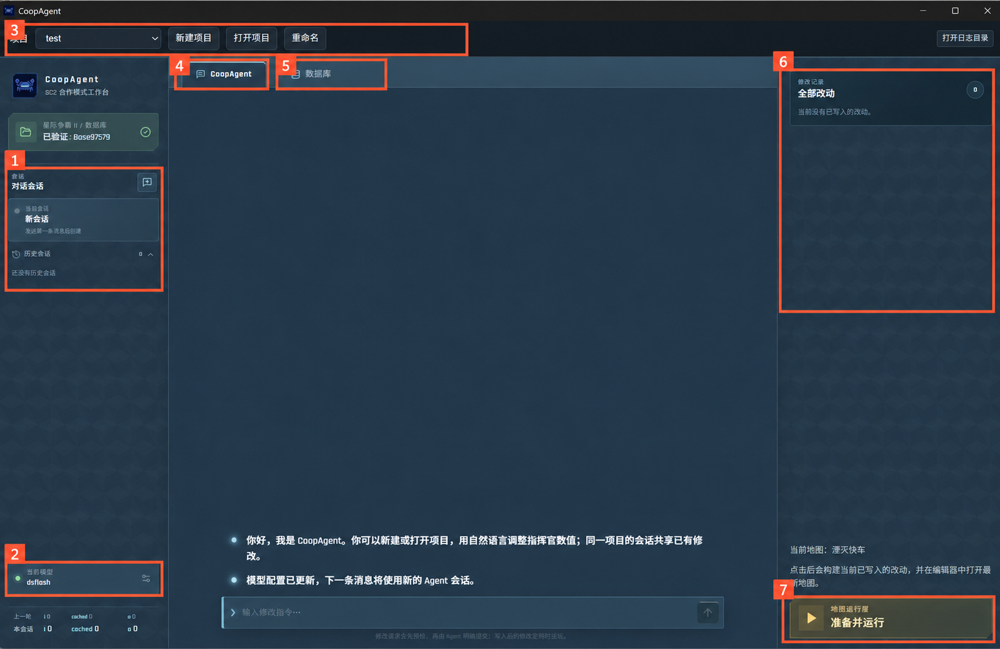
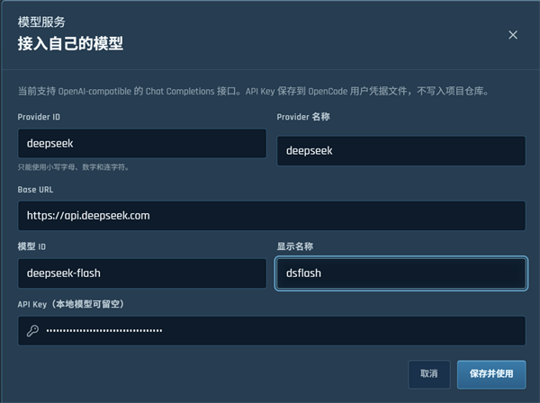
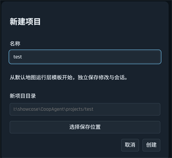
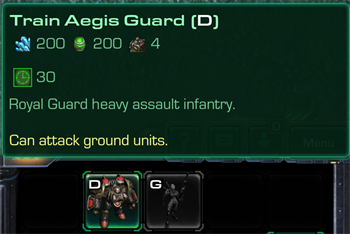
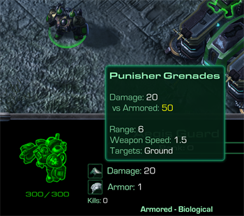

# 使用指南

## 启动与准备

CoopAgent 需要完成以下步骤才能正常运行：

1. 在仓库根目录运行 `start.cmd`，打开 CoopAgent。
2. 打开一个项目。初次使用会要求创建一个新项目，后续使用会自动打开上次的项目。
3. 配置好可用的模型 API。

## 界面介绍

### 1. 会话管理（sessions）

点击“对话会话”旁的加号新建会话（session）
历史会话显示在下方，点击即可切换。
让agent进行与前文无关的新修改时可以创建一个新的会话以节省上下文开支。

### 2. 模型配置

点击左下角的模型卡片会打开模型管理页面，可以添加模型配置，下图是模型配置的示例

Provider ID 可以自行命名，只能使用小写字母、数字和连字符，以字母或数字开头，最长 48 个字符。Provider 名称和显示名称用于界面展示，可以自行命名。Base URL、模型 ID 和 API Key 按模型服务商提供的信息填写。

### 3. 项目管理

上方的下拉框用于切换项目，旁边的按钮可以新建、打开或重命名项目。

每个项目单独保存会话、改动和地图内容。新建项目从原版合作模式配置开始，打开已有项目会恢复之前保存的内容。同一项目中的多个会话共用已有改动；想尝试另一套修改时，可以新建项目。项目默认保存在 CoopAgent 目录下的 `projects/` 文件夹中，也可以选择其他保存位置。

### 4. 对话（CoopAgent）

RT，和agent对话的页面。

### 5. 数据库

切换到“数据库”页签，可以浏览指挥官的等级升级、单位和面板技能。

如图，先点击左上角的加号，选择指挥官，之后需要一段时间解析数据，解析完成后会列出指挥官的升级/单位/面板/精通/威望等信息，点击会在下方展示详细信息，如下图所示：

（这个数据库页面的数据都是从游戏文件里解析出来的，会有缺单位/和游戏实际不一致的情况，仅供参考）

### 6. 改动记录

右侧“全部改动”显示当前项目已经写入的修改，包括修改内容、修改前后的数值和写入时间。

### 7. 启动按钮

点击“准备并运行”，会构建当前项目的地图并在编辑器中打开。
有时不能直接进入游戏，需要在编辑器主界面输入ctrl+F9。
当编辑器已经启动且agent做出了新改动时，按钮会变成“更新并运行”，需要先点击它再进入游戏，否则可能没有加载新改动。

## 查询与修改

在与agent对话时，建议先询问你要修改的单位/数值是什么，因为游戏里最终的数值可能是很多因素叠加的效果，数据库里的字段可能和游戏内数值不同，这样做可以先检查agent的理解是否正确（防止agent自己探索瞎猜浪费token），然后再让agent修改数值。
简单字段如生命值/费用也可以不询问直接修改，一般不会出现问题。
目前agent一轮运行的时长很不稳定，从1min到10min+都有可能，因此建议不要一次性输入太多任务。

下面是一个修改的例子，我先让agent查询蒙斯克壁垒卫士的属性（输入大帝的光头属性agent也能猜出来，但会有额外的开销和不稳定性），结果如下图：

然后让agent更改价格和武器伤害，如下图所示

agent完成修改后，点击右下角的“准备并运行”，等待游戏启动（如果没有启动就在编辑器主界面按ctrl+F9）

在游戏里可以看到agent已经按要求修改了费用和武器伤害，费用变成200/200，对重甲伤害为50 = 基础伤害 20 + 重甲加成 30

| 训练费用 | 武器伤害 |
| --- | --- |
|  |  |

有遗漏或不符合预期的地方，可以回到当前会话向 Agent 反馈。游戏结束后如有新修改，再点击“更新并运行”准备最新地图。

 ## 关于本地试玩
 目前通过agent自定义的合作模式只支持在编辑器中体验，且只接入了湮灭快车一张地图。无法联机，队友固定为雷诺。

 在选择指挥官时会看到一个“测试模式”的开关。启动后会在开局提供5000矿，2000气和200人口，方便尽快测试改动效果。

## 遇到问题

数据库未就绪或查询失败时，在环境设置或“全部改动”区域点击“重新检查”。需要查看日志、重新构建程序或重新准备环境时，参阅[安装指南中的排错说明](getting-started.md#安装或启动遇到问题)。
